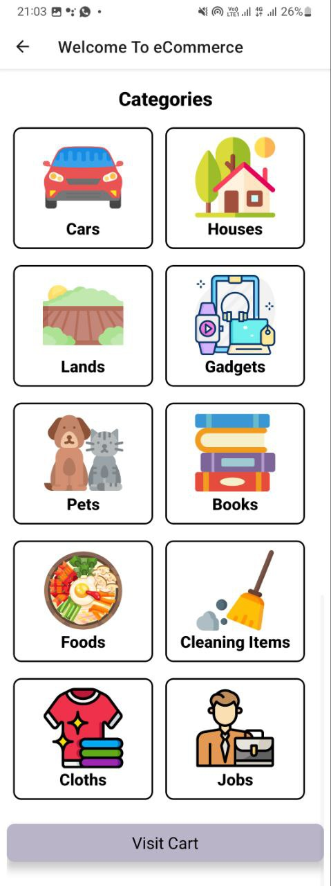
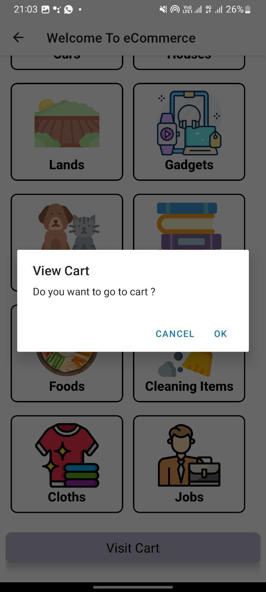

<h2>React Native Mart</h2>
<h3>Language --> Javascript(React Native)</h3>
This project a interface design of a online store which designed by React Native. In here I focused on the UI design only. 
<h1></h1>

This App has three interfaces,

    1. Login Interface.
    2. Sign up Interface .
    3. Categories Interface.

Here is some screenshots of the app,

<h1></h1>

<a href-"Https://ishanj.lk">Visit my personal website</a>
<h2>IshanJ</h2>
<h1></h1>